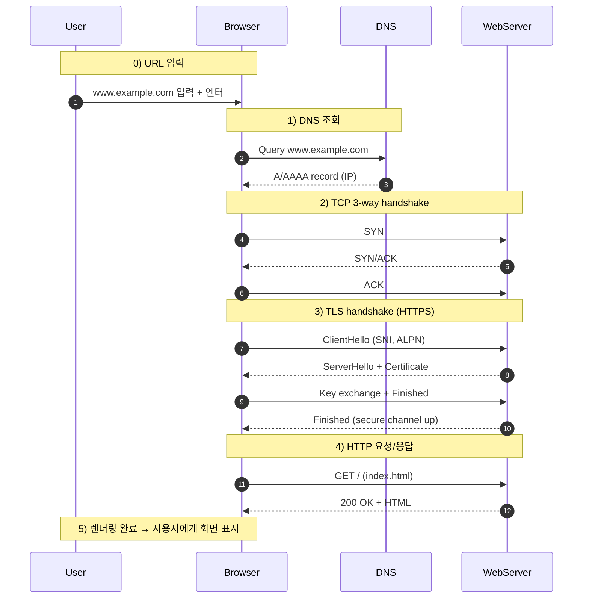

  
사용자가 브라우저 주소창에 URL을 입력하면, 브라우저는 먼저 <mark class="high">DNS 조회</mark>를 통해 도메인에 해당하는 IP 주소를 찾습니다.

  
그 후 <mark class="high">TCP 3-way handshake</mark>로 연결을 맺고, HTTPS라면 <mark class="high">TLS handshake</mark>를 추가로 수행해 안전한 채널을 수립합니다.

  
마지막으로 <mark class="high">HTTP 요청</mark>을 보내고 서버는 HTML, CSS, JS, 이미지 같은 리소스를 응답합니다.

  
요약하면 순서는 <mark class="mark">DNS 조회 → TCP 커넥션 → TLS 협상 → HTTP 데이터 통신</mark> 입니다.

## 🔥 결론

✅ **큰 흐름**

- **DNS 조회**: 도메인 → IP 주소 매핑
  - 브라우저 캐시 → OS 캐시 → 로컬 DNS 서버 → (필요 시) 루트 → TLD → 권한 DNS 서버
  - 최종적으로 IP 주소 획득
- **TCP 3-way handshake**: 연결 수립 (`SYN` → `SYN/ACK` → `ACK`)
- **TLS handshake (HTTPS)**: 인증서 검증 + 대칭키 협상
- **HTTP 요청/응답**: 문서 및 리소스 다운로드

✅ **최적화 포인트**

- DNS Prefetch, Preconnect, Preload, Prefetch 활용
- 웹폰트 최적화(font-display, subset, preload)

---

## Q&A

### Q1. DNS 조회는 어디서부터 차례로 일어나나요?

- 브라우저 캐시 → OS 캐시 → 로컬 DNS 서버
- 로컬 DNS 서버에 캐시가 없으면 루트 서버 → TLD 서버 → 권한 DNS 서버

---

### Q2. 로컬 DNS 서버는 내 컴퓨터 안에 있는 건가요?

❌ 아닙니다.

- 로컬 DNS 서버는 ISP(통신사)나 회사 네트워크가 운영하는 서버입니다.
- 내 컴퓨터(OS)에는 DNS 캐시만 있습니다.

---

### Q3. DNS TTL(Time To Live)은 누가 결정하나요?

- **도메인 권한 DNS 서버**가 TTL을 설정합니다.
- 예: A레코드 TTL=300초 → 캐시 5분 유지

---

### Q4. TCP 3-way handshake는 도메인 존재를 확인하는 건가요?

❌ 아닙니다.

- TCP handshake는 단순히 **연결 상태·시퀀스 번호 합의** 과정입니다.
- 도메인 존재 여부는 DNS 단계에서 확인합니다.

---

### Q5. TCP 시퀀스 번호는 왜 필요한가요?

- 데이터를 여러 패킷으로 쪼개 전송할 때 **순서 보장·손실 복구·중복 제거**를 하기 위해 필요합니다.
- 항상 0부터 시작하지 않고 무작위 ISN으로 시작 → 보안·세션 충돌 방지

---

### Q6. TCP 연결은 언제 끊기나요?

- 브라우저 닫을 때까지 무조건 유지되는 건 ❌
- **HTTP 버전, keep-alive, 서버 timeout**에 따라 달라집니다.
- 종료할 때는 **4-way handshake**로 양방향을 독립적으로 닫습니다.

---

### Q7. HTTP/1.1과 HTTP/2 차이는?

- **HTTP/1.1**: 커넥션 1개당 요청 1개 → 같은 도메인에서 최대 6개 연결 → 병목 발생
- **HTTP/2**: 한 커넥션 안에서 멀티플렉싱 → 사실상 수십 개 요청 동시 처리 가능

---

### Q8. HTTP/3는 왜 나왔나요?

- HTTP/2도 TCP 기반이라 패킷 하나 손실되면 전체 스트림이 지연 (HOL Blocking)
- HTTP/3는 **UDP 기반 QUIC 프로토콜** 위에서 동작 → 스트림 독립 처리 + 1RTT/0RTT 핸드셰이크 → 모바일 환경에서 성능 향상

---

### Q9. 성능 최적화를 위해 DNS/TCP/TLS 비용 줄이는 방법은?

- **dns-prefetch**: DNS만 미리 조회
- **preconnect**: DNS + TCP + TLS까지 미리 연결
- **preload**: 첫 화면에서 반드시 필요한 리소스를 미리 다운로드
- **prefetch**: 미래에 쓸 가능성이 높은 리소스를 낮은 우선순위로 미리 다운로드

---

## ✅ 최종 정리

- URL 입력 → **DNS 조회 → TCP 연결 → TLS handshake → HTTP 요청/응답**
- 각 단계마다 성능 병목이 존재하며, `preconnect`, `preload`, `font-display` 같은 최적화 기법으로 개선할 수 있습니다.

---

## 네트워크 시퀀스 다이어그램

## 📘 reference

- [MDN Web Docs - 브라우저 동작 원리](https://developer.mozilla.org/ko/docs/Web/Performance/How_browsers_work)
- [Cloudflare - QUIC과 HTTP/3 개요](https://www.cloudflare.com/ko-kr/learning/performance/what-is-http3/)
